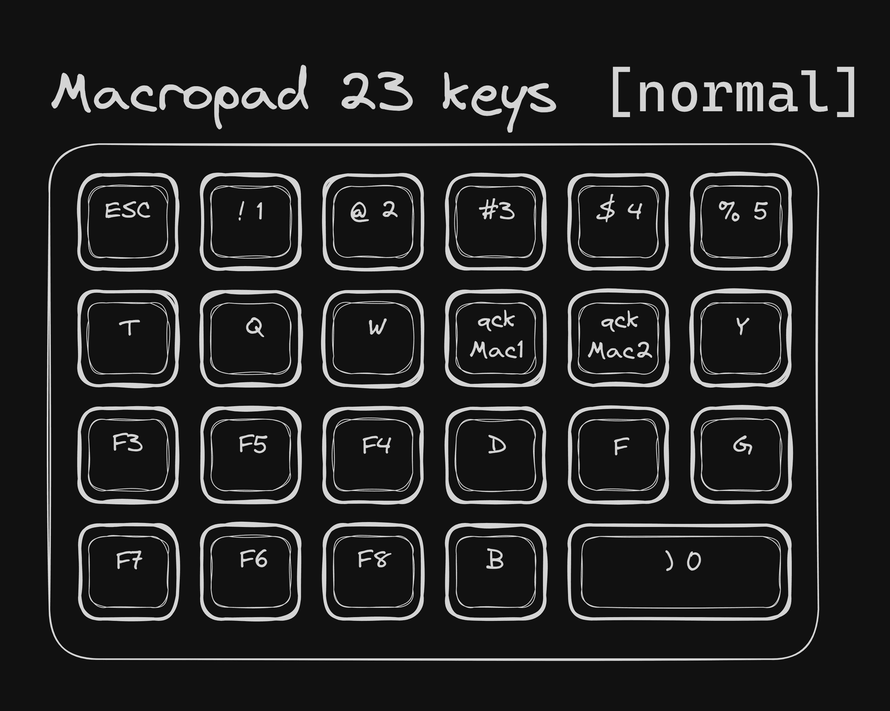

# macropad-excalidraw.ahk
## Задачи
1. Реализовать с помощью скриптов AutoHotkey работу макропада с плагином Obsidian Excalidraw:
   Макропад:  
  - [x] Перемещение по холсту вправо, влево, вверх, вниз.
  - [x] Приближение к указателю (курсору) и отдаление от него (зум), при помощи сочетания горячих клавиш назначенных макропаду.

## Macropad 23 keys

### Слой 1/4 - Normal

#### Описание
- **F3:** Отдалить холст ориентируясь на курсор мыши
- **F4:** Приблизить холст ориентируясь на курсор мыши
- **F5:** Переместиться вверх
- **F6:** Переместиться вниз
- **F7:** Переместиться влево
- **F8:** Переместиться вправо
- **QckMac1:** Нажать Ctrl+Shift+1 (переключиться на английскую раскладку клавиатуры)
- **QckMac2:** Нажать Ctrl+Shift+2 (переключиться на русскую раскладку клавиатуры)